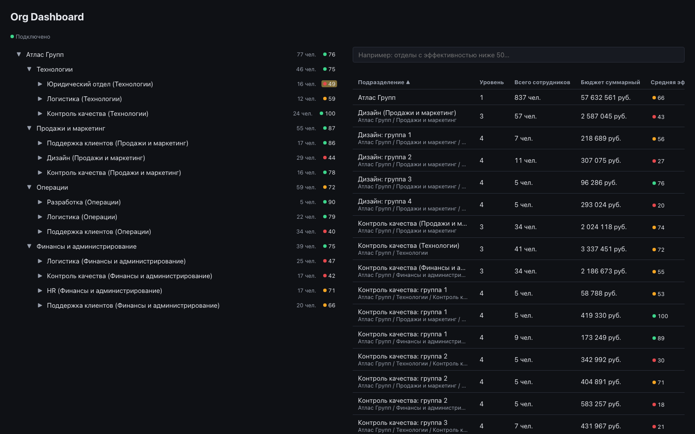

# Org Dashboard

Monitoring dashboard for a company's organisational structure (divisions →
departments → teams): a live, synchronised tree and analytical table with
subtree rollups, updated in real time over SSE, plus a natural-language
search over the table.

Status: **step/4 — Production** (all four milestones complete: foundation,
core table, realtime polish, Docker/Nginx + AI search). See
[CLAUDE.md](CLAUDE.md) for the full spec and milestone breakdown.



## Quick start (development)

```bash
npm install
npm run dev
```

This starts the API server on `http://localhost:3001` and the client on
`http://localhost:5173` (client dev requests to `/api/*` are proxied to the
server — see `client/vite.config.ts`).

Other commands (run from the repo root, applied across both workspaces where
relevant):

```bash
npm run typecheck
npm run lint
npm run test
npm run build
```

## One-command start (production, via Docker)

```bash
cp .env.example .env
docker compose up --build
```

Open `http://localhost:8080`. `client`'s Nginx serves the gzipped production
build and proxies `/api/*` to the `server` container, which isn't published
to the host directly. Leave `ANTHROPIC_API_KEY` in `.env` empty and the app
runs exactly the same — natural-language search transparently falls back to
plain-text matching (see "Natural-language search" below). `CLIENT_PORT` in
`.env` changes the published port from the default `8080`.

## Mock API debug switches

`GET /api/org-tree` supports query parameters for exercising each UI state
manually:

| Query | Effect |
|---|---|
| `?scenario=empty` | Returns `[]` |
| `?scenario=error` | Returns `500` |
| `?scenario=invalid` | Returns a payload that fails client-side schema validation |
| `?delay=5000` | Delays the response by the given number of milliseconds |

## Natural-language search

The table's search box accepts either a plain name (instant substring match)
or a natural-language query, e.g. "отделы с эффективностью ниже 50" or
"команды с бюджетом больше 10 млн" — the server asks Anthropic's Claude API
to turn it into a structured filter (headcount/budget/performance ranges,
level, name) and the table narrows to match. If that call fails for any
reason — no API key configured, a network error, a timeout, or a response
that isn't valid JSON — the search silently stays on the plain-text result
that was already showing; there's no error state to see. See
[docs/adr/0003-ai-search-fallback.md](docs/adr/0003-ai-search-fallback.md)
for the full design, and [docs/data-model.md](docs/data-model.md) for the
filter's exact shape. The API key is read only on the server and never ships
in the client bundle.

## AI in development

This project was built with AI assistance (Claude Code) throughout. A running,
honest log of what was generated, what was rewritten by hand, and why lives in
[docs/ai-log.md](docs/ai-log.md) — updated at the end of every work session.
